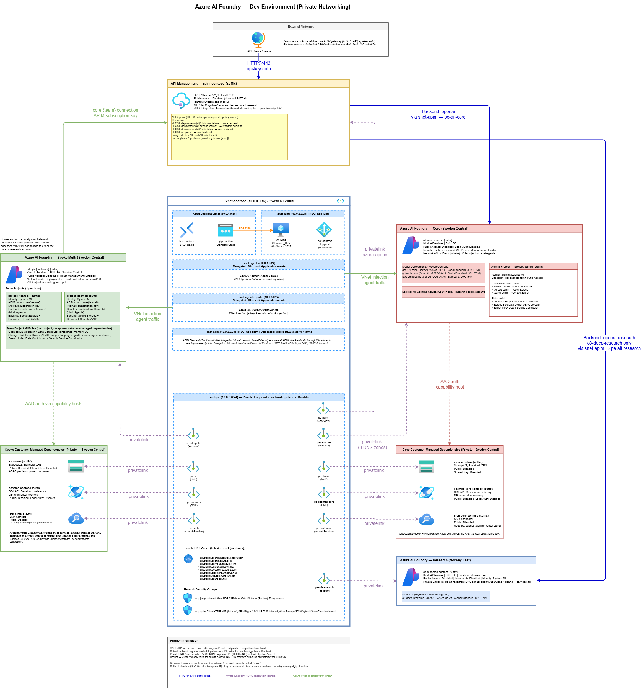

# Foundry NextGen LZ Private Network Isolation with Terraform

Provisions the complete hub-and-spoke AI infrastructure for Azure AI Foundry using Terraform. A single `terraform apply` creates two resource groups, two Foundry accounts with model deployments, an APIM gateway with routing policies and team subscriptions, a shared multi-project spoke account, one project per team, and all APIM connections and RBAC assignments.

An optional `enable_private_networking` flag deploys the complete private networking stack: private endpoints, private DNS zones, Agent Service dependent resources (Storage, CosmosDB, AI Search), capability hosts per team project, and a Windows Server 2022 jump VM with Azure Bastion for validation access.

---

The hub-and-spoke topology places an **API Management gateway** (StandardV2) at the centre, routing traffic to two AI Foundry accounts — `aif-hub` for general-purpose models and `aif-research` for reasoning/deep-research workloads. A shared multi-tenant spoke account (`aif-spoke-multi`) hosts one isolated project per team, each with its own APIM subscription key, RBAC scope, and — in private networking mode — a dedicated capability host backed by CosmosDB (thread storage), Azure Storage (blobs/files), and AI Search (vector store).

